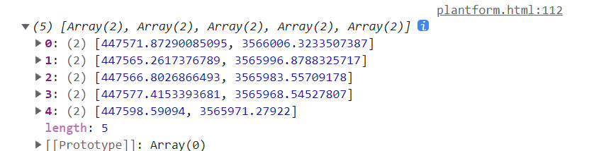
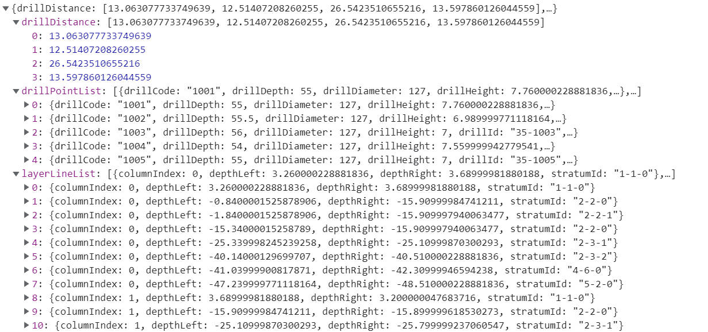
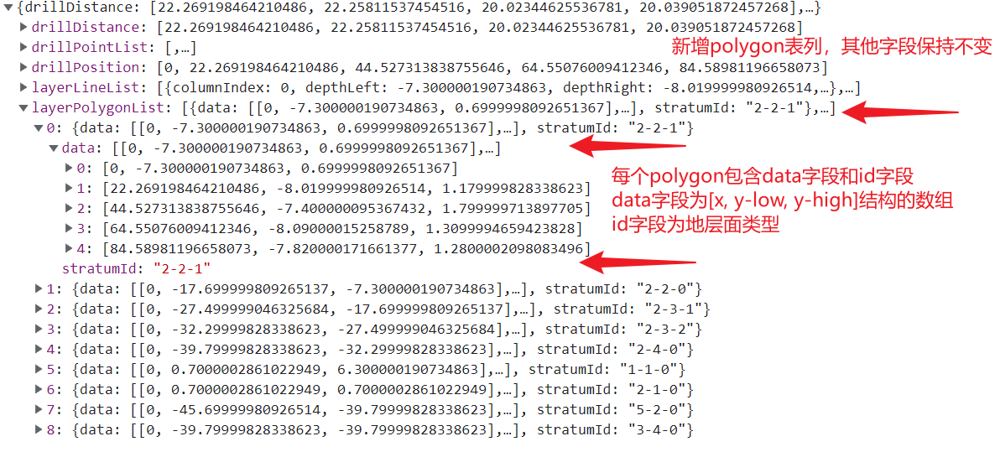

# 钻孔数据可视化项目

### 重要：编写代码过程中尽量多写注释，有助于Debug

## 使用方法：
    1. 默认进入index.html，选择可视化平台进入主页面，选择模拟输入输出进入测试页面
    2. 建议本地安装Tomcat8，以避免旧版本的乱码错误，但仍可以按照3使用集成Tomcat7
    3. 在idea中下载Maven Helper插件，然后右键项目->Run Maven->Tomcat7:run即可，按照提示打开网站
    4. CheckRuleConnector和MaxMatchConnnector均实现了Connector接口，可以切换两种连线方法

## 命名
    1. Geoserver工作空间dilldata
    2. Geoserver存储仓库drillpoints4mssql
    3. 图层名称drillpoints
    4. 图层标题drillpoints
    5. Geoserver端口8090
    6. MSSQL端口1433
    7. Tomcat端口80
    8. MSSQL数据库名drill
    9. MSSQL用户名sa
    10. MSSQL密码1234

## 输入输出数据流
    1. 前端向后端传送有序的钻孔XY坐标JSON数组
    2. 后端返回的JSON字符串中，字段drillPointList存储钻孔连线上所有钻孔的属性
    3. 后端返回的JSON字符串中，字段layerLineList存储弧段数组，弧段存在于两个相邻钻孔之间
    4. 弧段对象layerLine中，columnIndex为横坐标，即钻孔序号
    5. 弧段对象layerLine中，depthLeft和depthRight分别为弧段的起点和终点纵坐标
    6. 弧段对象layerLine中，stratumId为地层类型编号，指示该弧段以上到上一条弧段之间的区域的地层类型
    7. 后端返回的JSON字符串中，字段drillDistance表示相邻两个钻孔之间的距离

## 前端输出数据如下图：

## 后端返回数据如下图：

## PolygonList字段说明

## 注意：
    geoserver需要开启跨域，解决方案https://blog.csdn.net/xinleicol/article/details/118308342
